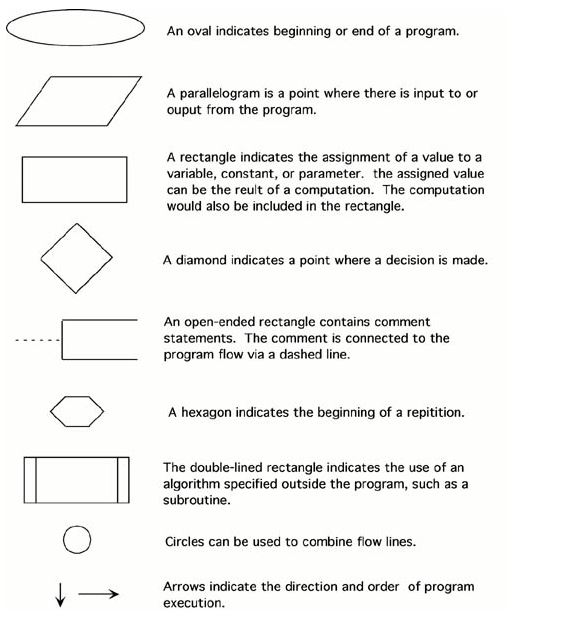
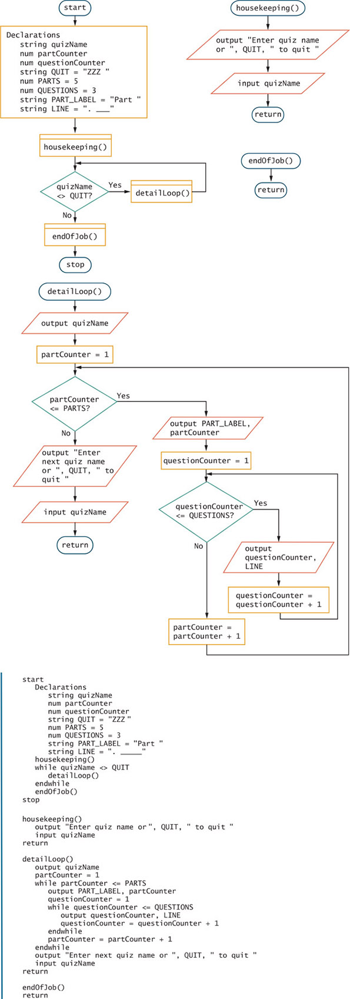
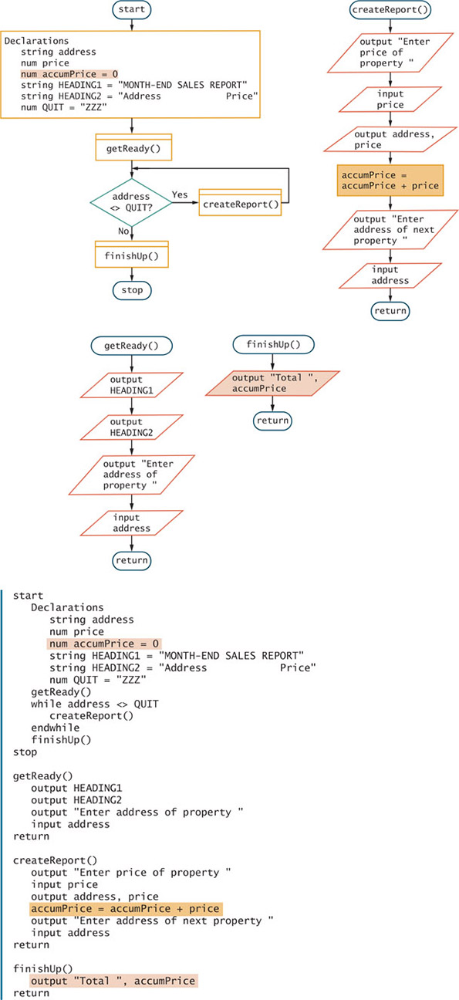
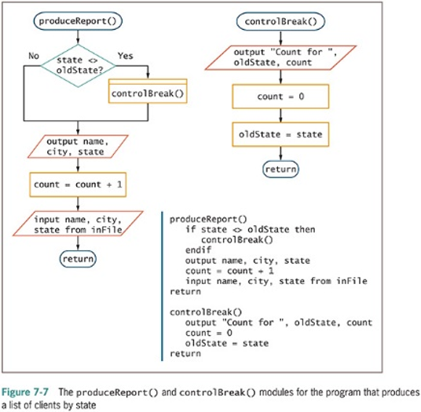
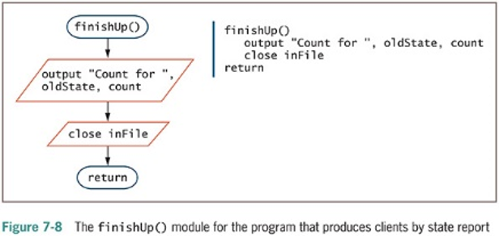
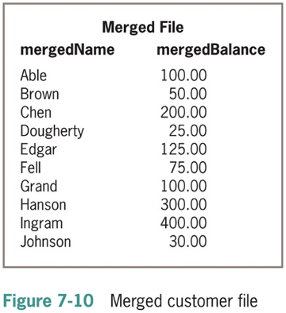
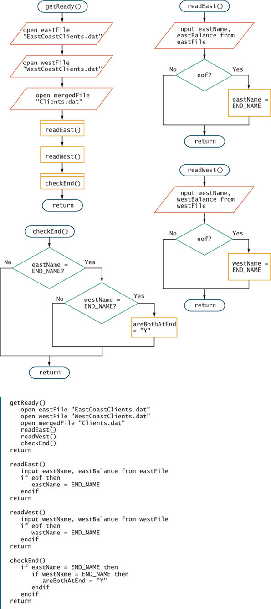
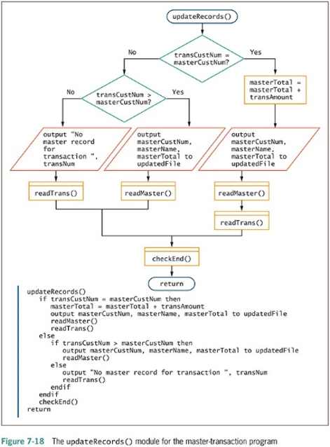

# Using Plant UML to create UML Psudocode and Trees to plan your code

> > 

<a href="https://www.youtube.com/watch?v=0MEs4WrOZmk">How to use it Click Here!</a>

# Computational Thinking Notes

> ## Chaper 1 Understanding Computer Systems

> A **computer system** is an combination of all components requireed to process and store data using a computer. It is composed of multiple pies of hardware and software.

> Software is grouped into 2 types.

1.  Application Software: programs like MS Word, photoshop or VScode that accomplish a task.
2.  System Software: Programs that manage your computer like Linux, Windows or OSX.

> ## Hardware and software accomplish 3 markor operations in most programs.

1. **INPUT:** Data items enter the computer system and are placed in memory, where they can be processed. **Data items** include all the text numbers and other raw materal that are entered into and processed by a computer.
2. **HARDWARE:** Devices that perform data operations such as mouse, kb and other gear.
3. **DATA ITEMS:** Include all the text, numbers and other raw materal that are entered into and processed by a computer.
4. **Processing:** Processing data items may involve organizing or sorting, checking for accuracy, caclucations etc.
5. **CPU:** Central processing unit.
6. **OUTPUT:** After data itmes have been processed, the resulting information usualy is sent to an output device, printer, monitor etc.
   > - **DATA** = input items
   > - **INFORMATION** = Data Items that have been processed though **output**. Sometimes you place output on **Storage Devices** like a hard drive, flash media, cloud etc.
   > - **Program Code:** = Writen instruction when you are coding the program.
   > - **Syntax:** = Rules governing a languages usage and punctuation.
   > - **Syntax errors:** = Misktakes an a languages usage. Syntax must be perfect for a computer to understand code.

> Programs are are stored in ** _computer memory_ ** in ** _RAM or Random Access Memory_ ** in a form of internal, volitile mory. Programs that are running and data items stored in RAM are for Quick access. _Internal Storage is **volatile** - and components can be lost when the computer is turned off or looses power. If you want to retrevie these instructions later you will also want to store them on a permanent storage device: disk, hard drive etc._

> > **Permananet storeage is _nonvolatile_ and can retain information without power.**

### The cycle of interpretation

> > Human readable code => Machine language aka Binary through a compiler. The compiler will highlight syntax errors as it finds them.

> ## Understanding Simple Program Logic
>
> > Psudocode is written in logical steps for humans to read.
> > 

> > Logic is important. If you write code that does not use the correct logic it could be like telling someone to make a cake in a _nonsensical_ way. Below is showing bad programing pratice.
>
> - Get a bowl
> - Stir
> - Add two eggs
> - Add a gallon of gasoline <= Bad
> - Bake at 350 degrees for 45 minutes
> - Add 3 cups of flour.

> > > _Logic errors are difficult to find._
> > >
> > > > Psuedocode
> > > >
> > > > > input myNumber
> > > > > myAnswer = myNumber \* 2
> > > > > output myAnswer

#The program Development cycle PT2

> The steps to write a program.
>
> 1.  Understand the problem.
>     > > - Output first: HR wants a list of employess who have been at the company at least 5 years.
>     > >   > - This is incomplete. Do they want to include Contractors, full time employees or emps on a month to month basis? 5 years sequencially? When is the cutoff?
>     > >   > - How should output be sorted?
>     > >   > - Fully understaning the problem can be the hardest part. A good programmer is part councler part detective.
> 2.  Plan the logic.
>     > > - **algorithm** is a sequence of steps or rules you follow to solve a problem.
>     > > - The programmer should not worry about syntax. The book focuses mostly on this step.
> 3.  Code the program
> 4.  Use software ( a compiler or interpereter) to translate the program into macine language.
> 5.  Test the Program aka QA.
> 6.  Put the program into production
> 7.  Maintain the program.

### The progrma development cycle in the image below.

### Creating an executable program

### Writing a flowchart and Psuedocode

> Vocabulary
>
> - **Terminal symbols** = Start/Stop
> - **Input Symbol** see image below
>   > 
> - **Processing symbol**
>   > 
> - **The Flowchart**
>   > 
> - A decision symbol is a diamond shape.
>   > 

> Good computer questions are booleans True/False or yes or no.

> > A Decision Tree

> - Start = pill shape
> - Input/Output = Parallelogram
> - Decision symbol = Diamond
> - process = rectangle

> Vocabulary
>
> - **Infinate loop:** a loop that never ends
> - **Sentinal Value:** also known as dummy value is preselected balue that stops the execution of a program.
> - The term **EOF** for end of file is comman term fro a file sentinel.
> - **Proceedureal programming:** focus on actions to be carried out - examplegetting input data for a n employee and writing the calculations needed to produce a paycheck.
> - **Object oriented programming** focuses on objects and describes their features and behaviors. Deisgn a payroll application by thinking about employee sand paychecks and describing their attributes such as
>   > - Emp name
>   > - Emp SSN
>   > - Emp paychecks with names and amounts.

# Chaper 2 Understanding Data Types

> > **DATA TYPE** a classification of what values can be held by the item, how it is stored in memory, what operations can be performed on the item.
>
> - **Numeric** numbers or decimal points.
>   > - Some programming languages differentiate between **integer** (whole numbers) variables and **floating -point** (fractional) numeric variables that contain a decimal point. Floating point numbers are also called **real numbers**.
> - **String** non numeric data.

## Understanding Unnamed, Literal Constants

> When you use a specific value in a computer program, it is one of two types of constants:
>
> > - **Numeric constant (or literal numeric constant)** is a number that does not change. When you store a numeric value in computer memory addition characters such as dollar signs and commas typicly are not input or stored. Those characters might be added to output for readability, but they are not part of the number.

> > - **String Constant(or literal string constant)** alphanumberic balues or a number in "43" this is a string.
> > - \*\*unnamed constants are numeric constants 43 and the strong constant "Amanda" are examples of unmamed constants they do not have identifiers like variables do.
> > - **Variables** A named memory location.
> >   > - Provide a data type -num or string
> >   > - Provide an identifier - One word, start with a letter, no spaces.
> >   > - Optionally provide a starting value or initial value. Variables can change. IF there is not an initial value garbage is stored in that location until a value is assigned.

> If you have two _Variables_ and one has no value assigned or _garbage_ it can not be added to the numeric value because it has garbage in it. This is illegal.

> > **My Age** = 41
> > **Your Age**
> >
> > > **My Age** + **Your Age** is illegal and will not compute because **Your Age** has **garbage** stored in it.

##RULES

> > > **Only numeric values can be assigned to numeric variables and string values can be assigned to String Variables**
> > >
> > > > - **Named Contants** are variables whose values do not change.
> > > >   > - In JavaScript these are called _const_ but in other programing languages a common practice is to write these variables in all caps **num TAX_RATE = 0.05**
> > > >   >   In most programming languages, beofre you can use any variable, you must include a declaration for it. A declaration is a statement that provides these things for a variable:

> > > - a data type
> > > - an identifier
> > > - optionally, an initial value.

> **Type-safety** is a feature of some programming languages that prevents assigning values of an incorrect data type. In those languages, you can assign a data item to a variable only if the data item is the correct type. This is called **strongly typed**.
>
> > Example
> > **taxRate = "2.5"** >>**inventoryItem = 2.5** > > **taxRate = inventoryItem** > > **inventoryItem = taxRate** You can't do this. Assigning a string to a numeric value is illegal.

##Understanding the Two Broad Data Types

> - Numeric Data
>   > - Contains digits
>   > - Optional + or -
>   > - Optional decimal point
>   > - No other punctuation such as \$, %, or comma.

> - String Data
>   > - Enclosed in quotation marks
>   > - Can contain letters, digits, and punctuation

> > Data types tell you how much memory is allocated for the item. This depends on the individual programming language.
> >
> > > +A data type of an item defines:
> > > -The set of values can be stored in the item.
> > > -The amount of memory allocated for the item.

> > > > > > **identifier = "variable value"**

> Variable Naming Conventions
>
> > **Camel casing** example _hourlyWage lastName_ Java, C#
> > **Pascal casing** example _HourlyWage LastName_ someties called **upper camel casing** Visual basic
> > **Hungarian notation** example _numHourlyWage_: a form of camel casing in which a variable's data type is part of the identifyer. _stringLastName_ often used in C for Windows API programming.
> > **Snake Casing** a convention in which parts of a variable name are separated by underscores. Common in C, C++, Python and Ruby: example _hourly_wage_ or _last_name_ > > **Mixed case with underscores** is a variable naming convention similar to snake casing with capitol letters: _Hourly_Wage_ or _Last_Name_ common in ADA

**BEST PRACTICE**: pick a naming convention and stick with it. Logic works for any language. Follow the naming conventions of the language you are using but make it easy on youself. 6 months rule. Will you remember your own code in six months?

> 1.  Variable names must be one word. The name can contain letters, digits, hyphens or underscores. No language allows embedded spaces in variable names. Most do not allow punctuation or spaces.
> 2.  _Variable names must start with a letter_. Some languages allow a variable to start with a nonalphabetic chracter such as an underscore. Most do not allow your variable to begin with a digit.

> 3.  Variable names should have some appropriate meaning. This is a best practice. If you are calculating an interest earned called the variable _interestEarned_.

UNIT 2 : Elements of High quality programs.

> Upon completion of this chapter, you will be able to:

# Use variables and constants

## Data Type

> > 1. What balues can be held by an item
> > 2. How the item is stored in computer memory
> > 3. What operations can be performed on the item

## Two types of Data

> > 1. Numeric
> > 2. String

> > Most language support other data types _Integer (whole numbers)_ and _floating-points (franctional)_ or decimal point values. Also called **real numbers**
> >
> > 1. Numberic Constant (or literal numeric constant)
> > 2. strong constant(or literal string constant)

> > **Unnamed constants** like the number 43 or the string "Amanda" are examples of Unnamed constants - they do not have identifiers like variables do.

> > **Type-safety** - prevents assigning values of incorrect data types. These are **strongly typed languages**

> > What is a variable
>
> 1.  A variable is a named memory location.
> 2.  Data types are -num and String
> 3.  Provide an identifier
>     > > -one word, start with a letter, no spaces
> 4.  Optionally, prvide a starting value aka inital value.

> > > > **Vocabulary** >>>> **Assignment statement** - in corporates two actions, first the computer calculates the arithmatic value of myNumber * 2. Second the computed value is stored in the MyAnswer memory location.
> > > > **Assigment Operator** a *binary operator\* = which requires two operands one on each side.
> > > > **Operand** is any value assined by an operator.
> > > > **right-associativity or right-to-left associativity** this means the value of the expression to the right of the assignment operator is evaluated first. and the result is assigned to the operand to the left.

# Perform arithmetic operations

Most programming languages use the following standard arithmetic operators

<table>
    <tr>
        <td>Operator</td><td>what it does</td>
    </tr>
    <tr>
        <td>+ (plus sign)</td><td>-addition</td>
    </tr>
    <tr>
        <td>- (minus sign)</td><td>Subtraction</td>
    </tr>
    <tr>
        <td>* (astrisk)</td><td>-multiplication</td>
    </tr>
    <tr>
        <td>/ (slash)</td><td>-Division</td>
    </tr>
</table>

# Recognize the advantages of modularization or decompization.

> > Breaking down code into smaller units that tackle one cohesive task at a time, these are called ** modules **.
> > _modules_ are also refered to as **subroutines**, **procedures**, **functions** or **methods**. Names depend on the programming language used.

## Why is modularization good?

> - Allows more than one person to work on a program.
> - Provides abstraction
> - allows you to reuse work more easily.
>   A module is called by using it's name.
>   **Modularization:** the process of breaking down a large program in modules. **functional decomposition** is the term used by computer scientists.

# Modularize a program

> - Modularization provides abstraction
> - Provides the _big picture_ abstraction is selctive ignorance.
> - Allows you to reuse work.

##Modularizing a program

###Understanding the most common configuration for mainline logic

> - **Housekeeping tasks**: include any steps you must perform at the beginning of a program to get ready for the rest of the program. These include Variable and constant declarations, displaying instructions to users, displaing report headings, opening requried files and inputting the first piece of data.
> - Inputting the first data item is always part of the housekeeping module.
> - **Detail loop tasks** core work of the program. Execute repeatedly for each set of input data.
> - **End-of-job tasks** steps you take at the end of a program to finish the appliction. These include clean up tasks, displaying totals and closing files.

> - Main program: contains basic steps or **mainline logic** when you create module, you include the following:
>   > - A header - The **module header** include the module idenifier and possibly other necessary identifying information.
>   > - **module body** contains all the staements in the module.
>   > - A _return_ statement: **module return statement** marks the end of the module.
>   > - Module names must start with a letter and cannot contain spaces.
>   > - Module names should have meaning. It is recomended to use a verb as the module perfomrs some action.
>   > - When the main program wants to use a module, it calls the module. A module can call another module, and the called module can call another. The number of chained calls is limited only by the amount of memory available on your computer. The flowchart symbol used to call a module is a rectangle with a var across the top. You place the name oif the mdule in side the rectangle.
>   >    > > 
>   >   Variables and constants are usable only in the module in which they are declared.
>   >   Programers say the data items are **visible** or **in scope** only within the mdoule they are declared. This means the program only recognizes them in the module they are declared. Variables and constants are **local** to the mdule in which they are declared.
>   >   Variables that are used by multiple programs are **portable**, self contained units.
>   >   **Global Variables and constants** are known to the entire program. They are declared at the program level and usuable by all modules. Variables declared with in a mdule are not usable elsewhere. They are only visible to that module.

> > 

# Create hierarchy charts

> Tells you what modules are called by other modules.

# Describe the features of good program design

> - provide program comments where appropriate
> - choose identifiers thoughtfully
> - Strive to design clear statements within your program and modules
> - Write clear prompts and echo input
>   +continue to maintain good programing habbits as you develop your programming skills.

#Mathmatical order of OPERATIONS

> > RULES
> >
> > 1. Parentheses () are first and move outward.
> > 2. Multiplication/division are next.
> > 3. Addition and Subtraction are last
> > 4. Work left to right.

#Practice

> Answer = 1 + 2 - 3/4 \* 5
>
> > We start with dividing 3/4 because it is closer to the left.
> > Answer = 1 + 2 - .75 \* 5
> > Answer = 1 + 2 - 3.75
> > Answer = 3 - 3.75
> > Answer = 0.75

#Unit 2 Test notes

> Q) What does a declaration provide for a variable?
> A) A data type and a name.

> List the disadvantages of unstructured spaghetti code
> Describe the three basic structures—sequence, selection, and loop
> Use a priming input to structure a program
> Show the need for structure
> Recognize structure
> Structure and modularize unstructured logic

Calculating the Percentage of a Whole
Image titled Calculate Percentages Step 1
1
Visualize what a percentage represents. A percentage is an expression of part of the whole. Nothing is represented by 0%, and the whole amount is 100%. Everything else is somewhere in between![1]
For example, say you have 10 apples. If you eat 2 apples, then you have eaten 2 out of the whole 10 apples (2 / 10 × 100% = 20% eaten). If 10 apples is 100% and you ate 20%, then 100% - 20% = 80% of the apples remain.
The term "percent" in English comes from the Latin per centum, meaning “through 100” or “for 100”.
The percentage symbol is merely a format. In statistics, percentages are often left in their base form of 0 - 1, where 1 represents the whole. We merely multiply a decimal by a factor of 100% to format the answer.

## Chapter 3 Understanding Structure

Upon completion of this chapter, you will be able to:

List the disadvantages of unstructured spaghetti code

> **Spaghetti code** messy code with hard to follow logic.
> **structure** a basic unit of programming logic. Each structure is one of the following.
>
> > - sequence
> > - selection
> > - Loop

Describe the three basic structures—sequence, selection, and loop
Use a priming input to structure a program
Show the need for structure
Recognize structure
Structure and modularize unstructured logic

### Sequence Structure

> **sequence structure** : A sequence can contain any number of tasks but there is no option to brach off and skip any tasks. Once you start a series of actions the sequence must complete until it ends.

> > 

> An example of how to illustrate sequence struction in directions from home.

> > 

### Selection Structure

> > **Selection structure** or **decision structure** evaluates a **Boolean expression** True/False evaluation based on a computer's two state on-off switches (0 or 1).

> > 

> > **End-structure statement** that is used in this psudocode (also known as **if-then-else**).
>
> 

> > if someCondition is true then  
> > do oneProcess  
> > else  
> > do theOtherProcess  
> > endif
> 

# Unit 3

### Loop Structures

> A loop Structure continues to repeat an action while a test or condition remains true. The actions occur within the **loop body**. You exit the loop once the condition becomes false. This is also called a **While Loop**. Pseudocode is shown below.Looping is also called **repetition** or **iteration**.
>
> 

> while
> do action while condition is true  
> when action is false exit  
> 

> > 

3 Structures **Sequence, Selection, Loop**. You can combine these strutures, stack then or nest them. You use these three structures to solve every programing problem.

<table>
<tr>
<td>
<b>Sequence</b>
</td><td>
<b>Selection</b>
</td><td>
<b>Loop</b>
</td></tr>
<tr><td></td></td><td></td><td></td>
</tr>
</table>

> > 

**Null Branch** the path where no decision is made.

## Why use Structure?

> **Clarity** - Programs get bigger and more complex. Structured programs are much less confusing
> **Professionalism** - THis is the expected best practice.
> **Efficency** - Structured programs can be easier broken down into modules.
> **Maintenance** > **Modularity**

> **Structured programs are sometimes called goto-less programming**

## Recognizing Structure

Unstructured Dog washing

Structured Dog washing

Unit 3 review
Spagetti Code: Snarled, unstructured program logic.

> Unit 3 test

> 1.  When you must perform one action when a condition is true and a different on when it is false, you use a **dual-alternative selection**
> 2.  A group of statements that executes as a unit is a **block**
> 3.  A **Boolean** expression has one of two values, often expressed as True or False.
> 4.  Which of the following is true of structured logic?
>     Any task can be described using some combination of the three structures sequence, selection and loop.
> 5.  When you input data in a loop within a program the input statement that preceedes the loop is called a priming input.
> 6.  The three structures of structured programming are **sequence, Selection and loop**
> 7.  When a loop executes, the structure-controlling condition is tested either before or after the loop body executes.
> 8.  Which of the following attributes do all 3 basic structures share? They all have one entry and one exit point.
> 9.  To take action as long as a condition remains true you use a **loop**.
> 10. Attaching structures end to end is called **Stacking**
> 11. Which of the following is not another term for selection structure? Loop structure.
>     > > **dual-alternative structure, if then-else structure and decision structure** are all terms refering to selection structure.
> 12. Which of the following is accetable in a structured program?
>     > > **Placing a sequence within the true branch of a dual-laternative decision**
>     > > Placing a loop within one of the steps in a sequence.
>     > > Placing a decision within a loop. All are acceptable in a strucured program.
> 13. Which is true of stacking structures? Each structure has only one point where it can be stacked on top of another.
> 14. Placing a structure **within** another structure is called **nesting** structures.
> 15. A sequence structure can contain any number of tasks.
> 16. When an action is requried if a condition is true, but no action is needed if it is false you use a **single-alternative selection**

> 17. Snarled program logic is called spaghetti code.
> 18. Which of the following is not a benefit of modularizing programs?
>     > > Some benifits are Multiple programmers can work on different modules at the same time. Modular components are reusable in other programs. Modular programs are easier to read and understand than non modular ones. The answer to this question which is not a benifit to modularizing programs: if you use mdules you can ignore the rules of struture. This is not true. You should never ignore structure.
> 19. In a selection structure the structure-containing condition is tested once at the beginning of the structure.

# Chapter 4

## The Selection Structure

> > Starts with the evaluation of a Boolean expression and takes one of two paths based on the outcome.  

### This is a structure **if-then-else** selection.

> > 

### if-then selection or single-alternative selection structure

> > 

> > The _else_ clause executes when a condition is false.

> > Shown in FIGure 4.2 the single-alternative selection struture also called the _if-then_ selection, because no alternative or **else** action is necessary.

> > 

## Nesting and Decisions for Efficency

> > Looking in Dept in And OR decisions
> > With an **AND** decision, two conditions must be true to result in an action.
> > For instance, _if a customer owes more than \$10 **AND** is past due more than 15 days. Add a penalty to the customer's total_
>
> > > 

> > > 

> > Computers can only make one decision at a time. Evaluating a decision often make the second decision not needed. THis saves processing power and does not short circut the logic.

## THe OR operator

You can ask either question first. The fewer decisions you make the faster the program.

1. First evaluate the decision that is most likely to be true.
2. Make sure that boolean expressions are complete.
3. Make sure you ulse _OR_ selections when they are required.
   

## Understanding Not LOGIC !=

1. Truth table for the not operator
2. 

## Range Checks

1. Dead or unreachable path is a path that logicly will never be reached.

##The _case_ structure is used to test a signle variable formutiple values.

Chapter Summary

1. Computer program decisions are made by evaluating Boolean expressions. You can use if-then-else or if-then structures to choose between two possible outcomes.

2. You can use relational comparison operators to compare two operands of the same data type. The standard relational comparison operators are =, >, <, >=, <=, and <>.

3. In an AND decision, two conditions must be true for a resulting action to take place. An AND decision requires a nested decision or the use of an AND operator. In an AND decision, the most efficient approach is to start by evaluating the expression that is less likely to be true.

4. In an OR decision, at least one of two conditions must be true for a resulting action to take place. In an OR decision, the most efficient approach is to start by evaluating the expression that is more likely to be true. Most programming languages allow you to ask two or more questions in a single comparison by using a conditional OR operator.

5. The NOT operator reverses the meaning of a Boolean expression.

6. To perform a range check, make comparisons with either the lowest or highest value in each range of comparison values. Common errors that occur when programmers perform range checks include asking unnecessary and previously answered questions.

7. When you combine AND and OR operators in an expression, the AND operators take precedence, meaning their Boolean values are evaluated first.

8. The case structure is a specialized structure that can be used when there are several distinct possible values for a single variable, and each value requires a different subsequent action.

# Chapter 5 Loops

Chapter Goals
Upon completion of this chapter, you will be able to:

## List the advantages of looping

1. Makes computer programming efficient and worthwhile
2. Use one set of instructions multiple times.
3. Less time is required for design and coding
4. fewer errors occur
5. shorter compile time.

### Basic Structure of a business program

> For example, Figure 5-2 might represent the mainline logic of a typical payroll program. The first employee’s data would be entered in the housekeeping() module, and while the eof condition is not met, the detailLoop() module would perform such tasks as determining regular and overtime pay and deducting taxes, insurance premiums, charitable contributions, union dues, and other items. Then, after the employee’s paycheck is output, the next employee’s data would be entered, and the detailLoop() module would repeat for the next employee. The advantage to having a computer produce payroll checks is that the calculation instructions need to be written only once and can be repeated indefinitely. At some point, when the program attempts to retrieve data for a new employee, the eof condition would be met, and the loop that contains the detailLoop() would be exited. Then the endOfJob() module would execute; it might contain tasks such as making sure data files are closed or displaying payroll totals.

### Video structures

> A loop structure executes continuously while a condition remains true.
>
> > Example: Are you still mad at me > "boolean" Loop until something changes > loop ask again etc.

## Use a loop control variable

> Instructions

1. The loop control variable is initialized before entering the loop
2. The loop control variable's value is tested and if the result is true the loop body is entered.
3. The loop control variable is altered within the body of the loop so that the tested condition that starts the loop eventually is false.

> _Infinate loop_ : this can occur when you omit any of these actions
>
> 1. Initalize
> 2. test
> 3. alter or perform the test incorrectly

> > \*Controling a loops repetitions in one of two ways
> >
> > - use a counter to create a definate, _counter-controlled loop_.
> > - Use a sentinel value to crate an indefinite loop.

## Create nested loops

> > **Nested Loops**: Make program logic more complicated but more efficient.
> > **Outer Loop** and **Inner Loop**.
> > You need to create nested loops when the alues of two or more variables repeat to produce every combination of values.
> > 
> > Writing PseudocodeIn Figure 5-8, some output (the user prompt) would be sent to one output device, such as a monitor. Other output (the quiz sheet) would be sent to another output device, such as a printer. The statements needed to send output to separate devices differ among languages. The statements to set up the printer would be included in the housekeeping() module, and the statements to disengage the printer would be included in the currently empty endOfJob() module. Chapter 7 provides more details about sending output to separate files.

## Identify common loop mistakes

### Common loop mistakes to avoid

> > 1. Failing to initalize the loop control variable
> > 2. Neglecting to alter the lop control variable
> > 3. Using hte wrong type of comparison when testing the loop control variable.
> >    > - example using <= instead of < can end in extra payments, medication etc.
> > 4. Including statements inside the loop body that belong outside the loop.

## Use a for loop

## Use a posttest loop

> > Also called a **do-while** loop. The loop will test the controling condition at the bottom of the loop. The action must be run at least once before the test.

## Recognize the characteristics shared by all structured loops

## Describe common loop applications

1. Accumulate totals initlalized to 0.
   - no need to make zero at the end. It will be a different memory location.
2. Calculate data
   

   Writing PseudocodeSome programming languages assign 0 to a variable you fail to initialize explicitly, but many do not. When you try to add a value to an uninitialized variable, most languages will issue an error message; worse, some languages, such as C and C++, will let you incorrectly start with an accumulator that holds garbage. All of the examples in this book assign the value 0 to each accumulator before using it.

Writing Pseudocode
In earlier program examples in this chapter, the modules were named housekeeping(), detailLoop(), and endOfJob(). In the program in Figure 5-22, they are named getReady(), createReport(), and finishUp(). You can assign modules any names that make sense to you, as long as you are consistent with the names within a program.

## Differentiate between selections and loops

# Chapter 6 Arrays

> _ARRAYS_ Must contain the same data type.

> Single dimensional arrays are similar to _lists_ but multiple dimensional arrays are not.

## How Arrays Occupy Computer Memory

1. Each data item is one element of the array.
2. Has the same data type.
3. Occupys an area in memory next to or contiguous to the others.
4. Size of the array: number of elements the array will hold.
5. Subscript or index starts with 0.
6. populating the array: providing values.

## Accumulating values in an Array

1. Delare variables and constants

> > **Parallel Arrays** are two or more arrays in which each element in one array is associated with the element in the same relative position in the other array.
> > Walk through the logic and see whether the appropriate Item not found message is displayed. The relationship between an item’s number and its price is an indirect relationship

# Chapter 6: Arrays

# Chapter 7: File Handling and Applications

> **permanent storage** : stored on a device such as a disk or hard drive etc to be accessed later.
> **temporary storage** : lost when the program ends or the computer looses power.
> **computer file** a colletion of data stored on an nonvolativel device in a computer system. These can be text files and binary files.

> **Text files** contain data that bean be read in a text editor because the data has been encoded using a scheme such as ASCII or Unicode.
> **Binary files**: contain data that has not been encoded as text, ie images or music. This is now an image can have a trojan embeded in it.

> Each file contains a name and extension as well as times associated with it, cration time and time last modified.

> File size: **byte**: small unit of storage
>
> > **kilobyte**(thousands of bytes)
> > **megatytes**(millions of bytes)
> > **gitabytes**(billions of bytes) and so on.

## SUPERBASIC

**path**: file location on hard drive in folders.

**file sizes**: smallest computer can display is 1KB.

## DATA Heirarchy

> > The smallest piece of data useful to humans is a **character**.
> > Characters are grouped togther to make **fields**.
> > fields are grouped together to make **records**
> > A **record** consists of all the fields that have to do with one entity such as a person place or thing.
> > **Records are grouped together to make files**: A data file consists of all the records to go together to solve a problem.

> > **database**: holds related file data in tables. Database software estabalishes and maintains relations between fields in the tables, so that users can pull related dat items together in a format that allows business people to mak emanaerial dections efficiently.

> > 1.  In the data heiracrhy, a field is a single data item, such as lastName, streetAddress, or annualSalary.
> > 2.  In the data heirarchy, fields are grouped together to form a record; records are grups of fields that go totheter for some logical reason.

## Performing File Operations

> 1.  Files can be characterized if they can be used as an input or output file.
>     > _Example_: InputFile employeeData
>                  OutputFile updatedData

## Opening a file

> > In most programing languages, before an applicaiton can use a data file, it must **open the file**. \*Opening a file locates it on a storage device and associates a variable name within your program with the file.

> > **EXAMPLE: open employeeData "EmployeeData.dat"**

> > If the program is not in the same directory you must specify a file path.

> > **EXAMPLE: open employeeData "C:\CompanyFiles\CurrentYear\EmployeeData.dat"**

## Reading Data from a File and PRocessing it

1. You never use the data values that are stored on a storage device directly. Instead you use a copy that is transferred into memory. When you copy data from a file on a storage device into RAM you are reading from a file.
2. When data items are stored on a disk, their location might not be clear to you. Although data is now often saved without asking at any moment in time the version of the file in memory might differ from the version last saved to a storage device.
3. Once an identifyer **employeeData** has been associated with s stored file, you can write separete programming statements tin input each filed.
   > > **input name from employeeData** >> **input address from employeeData** >> **input payRate from employeeData**

> Most programing languages allow you to write a single statment in the following format:
>
> > **input name, address, payRate from employeeData**
> > You can declare a group item when you delcare other variables:
> > **EmployeeRecord** > >**string name** > >**string address** > >**num payRate**

> > Employee Record is the group name. It can be called with
> > **input EmployeeRecord from employeeData**

- Note 1: You usually do not want to input several items in a single statement when you read data from a keyboard, because you want to prompt th euser for each item separately as you input it.
- Note 2: When you retreive data from a file, prompts are not needed. Instead, each item is retreived in sequence and stored in memory and appropriate named location.

### A computer file can read a file sequencially or randomly.

1. **sequential file**: reads records in the file from beginning to end, processing them one at a time.
2. **sorting**: the process of placing records in order by the value in a specific field or fields.
3. **Ascending order**: sorted in order from lowest to highest.
4. **Descending order**: describes records in order from highest to lowest values.
   - records can be sored manually befor ethey are entered and saved or entere in any order.

# Writing Data to a file.

> > **write to the file**: copy data from RAM to the file. When you wirte data to a file you write the contents of the fields using a statement such as the following:
> > **output name, address, payRate to employeeData**

# Closing a file

- A closed file is no longer available to your appliction.
- Data might not be saved correctly and might become inaccessible if a file is not closed.

> > **default input and oupt devices** Most programing languages allow your to write from kb to the display monitor without issuing open or close commands.

# A program that performd file operations.

## When a program uses a data file, typical operations include:

- opening files
- rading from the input file
- writing to the output file
- closing the files.

The figure below shows how to lay out a program and call closing module.

- Backup File

  - a copy kept in case values needed to be restored to their original state.
  - The backup copy is called a **parent file**
  - The newly revised copy is a **child file**

## Control Break Logic

- A **control break** is a temporary detour in the logic of a program.

  - A **control break program** uses a change in a value to initiate special actions or processing
  - a **control break report** groups similar data together

  * input records must be in sequential order

  ### Understanding Control Break Logic

  - Examples of control break reports

* -All employee listed in order by department number, with a new page started for each department
* - All books for sale in a bookstore listed in order by category (such as reference or self-help), with a count following each category of book.
* - All items sold in order by date of sale, with a different ink color for each new month.

* Single-level control break
  - A detour based on the value of a single variable
  - Uses a **control break field** to hold the previous value
    
    

## Merging records

- **Merging Files**
- - Combineing two or more files while maintinaing the sequential order or the records.
- **Examples**
- - A file of current employees in ID number order, and a file of newly hired employees also in ID number order.
- A file of parts manufactured in the Northside factory in part-number order, and a file of parts manufactured in the Southside factory also in part-number order.

* Two conditions requred for merging files

- - Each file has the same record layout
- - Sorted in the same order based on the same field.
     

## Merging Sequential Files

- Mainline Logic similar to other file-processing programs, expect for handing two files.
- With two input files, must determine when both files are at _eof_
- - Define a flag variable to indicate that both files have reached _eof_
- - Must define two input files
- \_ Read one record from each input file.
  

  

  ### Merging Sequential files

  

  ## Master and Transaction File Processing

  - Some related files have a master-transaction relationship
  - **Master File**
  - - Hold complete and relitively permanent data
  - ** Transaction file**
  - - Contains temporary data to be used to update the master file.
  - **Update the master file**
  - - Changes the values in the fields based on transactions.

# Master and Tansaction File Processing

- Examples
  - A library maintians a master file of all patrons and a tansation file with information about each book or other items checked out.
  - A college maintains a master file of all studnets and a transaction file for each course regisration.
  - A telephone company maintains a master file of every telphone line (number) and transaction file with information about every call.
- Updating approaches
- - Change information in the master file
- - Copy master file and change new version
- Being with both failes sorted in the same order on the same field.
  

  

  

# Random Access Files

- **Batch processing**
- - Involves performing the same tasks with many records, one after the other.
- - Uses sequential files.
- **Real-Time** applications
- - Requite that a record be accessed immediately while client is waiting.
- **Interactive program**
- - A program in which the user makes direct requests.
- - Records can be physically located in any order
- - **Instant access files**
- - Fiels in which records must be accessed immedately
- - Also known as **direct Access Files**

# Summary

1. Computer file
   - A collection of data stored on a nonvolitile devie in a computer system
2. Data Items are stored in a heirarchy
3. To use a data file you must declare, open, read, write, and close the file.
4. Sequential file: records stored one after antoher in some order.
5. Control break program reads a sorted sequential file and performs special processing based on a change in one or more fields in each record in the file.
6. Merging files combines two or more files.
   - Maintians the same sequential order
7. Master Files
   - Hold permanent data
   - Updated by tansaction files.
8. Master files

- Hold relatively permanent data
- Updated by tansaction files

9. Real-time applications
   - Require random access files where records can be located in any order.
10. Instant access files and direct access files are files in which records must be accessed immediately.

# CHAPTER 10: Unit 8 Object oriented programming

## Principles of Object-Oriented Programming

- **Object-Oriented programming (oop)**
- - A programming model that focuses on a application's components and data and the methods to manipulate htem.
- - Uses all of the familiar concepts from modular procedural programming.
- -- Variables, methods, passing structures
- -- But involves a different way of thinking.

- \*\*Important features of object-oriented languages
- 1. Classes
- 2. Objects
- 3. Polymorphism
- 4. Inheritance
- 5. Encapsulation

  ## Classes and Objects

  **Class**

  - Describes a group or collection of objects with common attributes.
    **Object** - One **instance** of a class
  - Sometimes called one **instanctiation** of a class.
  - Whenb a program creates an object, it **instantiates** the object.
  - - Example
  - - - Class name: dog
  - - - Attribues: name, age, hasShots
  - - - Methods: changeName, updateShots
  - ** Attributes**
  - - - Characteristics that define an object as part of a class
  - - - **Example**: Automobile's make, model, year and purchase price.

  **Methods**

  - Actions that alter, use, or retrive the attributes.
  - Example: Methos for change an automobile's running status, gear, speed and cleaniness.

  

  - Think in an object-orietned manner
  - - Everything is an object
  - - Every object is a member of a class
  - **Is a relaction ship**
  - - My oak desk wiht the scratch on the top is a _Desk_
  - Class reusability
  - Class's instance variables
  - - Data components of a class that belong to every instantiated object.
  - - Often called fields
  - **State**
  - - A set of all the values or contents of a class object's instance variables.
  - Every object that is an instance of a class possesses
  - **Class client** or **class user**
  - - A program or class that instantiates objects of another prewritten class.

## Polymorphism

- The world is full of objects
- - A door is an object that needs to be open or closed
- - But an "open" procedure works different on different objects.
- - - Open a door
- - - Open a drawer
- - - Open a bank account
- - - Open a file
- - - Open your eyes
- - One "open " proceedure can open anything if it gets the correct agruments.
