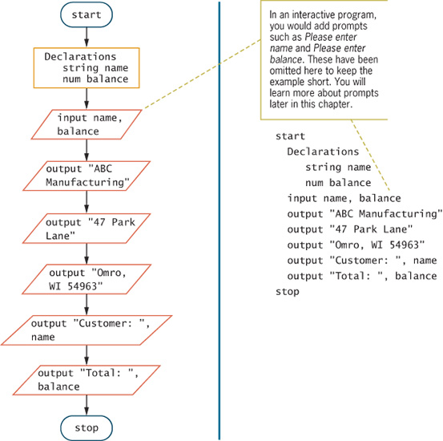
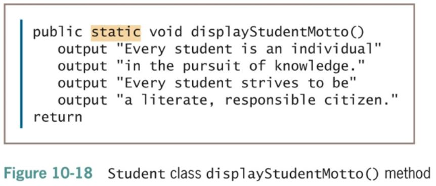

_Notes: These are final exam study notes from the index cards of the review function of the textbook_

# UNIT 1: Programming Logic and Design Ninth Edition

## Chapter 1 An overview of computers and programming.

- **Computer system**
  - Combination of al lthe components required to process and store data using a computer.
- **Hardware**
  - Equipment associated with a computer
- **Software**
  - Computer instructions that tell the hardware what to do
  - **Programs**
    - Instructions written by programmers
  - **Programming**
    - Writing software instructions
  - **Application software** such as word processing, spreadsheets, payroll and inventory, even games, apps etc.
  - **System Software** such as operating systems like Windows, Linux, or UNIX, Google Android and Apple IOS.
- Computer Hardware and software accomplish three major operations
  - **Input**
  - **Data items** such as text, numbers, images, and sound
- **Processing**
  - Calculations and comparisons performed by the **central processing unit (CPU)**
  - **Output**
  - Resulating **information** that is sent to a printer,a monitor, or **storage devices** after processing
  - A **cloud** based device is accessed through the internet
- **Programming language**
  - Used to write computer instructions called **program code**
  - Writing instructions is called **coding the program**
  - Examples: Visual Baisc, C#, C++, or JAVA.
- **SYNTAX**: Rules governing the word usage and punctuation
  - Mistakes in a language's usage are **syntax errors**
- **Computer memory**
  - Computer's temporary, internal storeage- \*\*random access memory(RAM)
  - **Volatile** memory - lost when the power is off.
- Permanent storage devices
  - **Nonvolatile** memory
- **Compiler** or **interpreter**
  - Translates **source code** into **machine language (binary language)** statements called **object code**
  - Checks for syntax errors.
- Program **executes** or **runs**
  - Input will be accepted, some processing will occur, and results will be output.
- Programs with syntax errors cannot execute
- **Logical errors**
  - Sequence of specific instructions in specific order.
- **Variable**
  - Named memory location whose value can vary.

## Understanding the Program Development Cycle

- **Program development cycle**

  1. Understand the problem
  2. Plan the logic
  3. Code the program
  4. Use software (a compiler or interpreter) to translate the program into machine language.
  5. Test the program
  6. Put the program into production
  7. Maintain the program

  - 

- **Understanding the Problem**
  - One of the most difficult aspects of programming
  - **users** or **end users**
    - People for whom a program is written
  - **Documentation**
    - All supporting paper work for a program.
- **Planning the Logic**
  - Plan the steps of the program and what they include.
  - An **algorithm** is the sequence of steps or rules you follow to solve a problem.
  - Most common planning tools
    - Flowcharts
    - Pseudocode
  - **Desk-checking**
    - Walking through a program's logic on paper before you actually write the program.
  - **Coding the Program**
    - Hundreds of programming languages avaiable
      - Choose based on features
      - Similar in their basic capabilities
    - Coding is easier than the planning step
    - Experienced programmers can sucessfully combine logic planning and program coding in one step.

## Using Software to Translate the Program into Machine Language

- Translator program
  - Compiler or interpreter
  - Changes the programmer's English-like **high-level programming language** into the **low-level machine language**
- **Syntax error**
  - Misuse of a language's grammar rules
  - Programmer corrrects listed syntax errors.
  - Might need to recompile the code several times.
    
- **Testing the Program**
  - Logical error
    - Results when syntactically correct statement, but the wrong one for the current context, us used.
  - Test
    - Execute the program with some sample data to see wheather the results are logically correct.
  - **Debugging** is the process of finding and correcting program errors.
  - Programs should be tested with many sets of data.
  - Process depends on program's purpose
    - May take several months.
  - **Conversion**
    - The entire set of actions an organization must take to switch over to using a new program or set of programs.
  - **Maintenance**
    - Making changes after the program is put into production
  - Common first programming job
    - Maintaining previously written programs
  - Make changes to existing programs
    - Repeat the development cycle.
  - **Pseudocode**
    - English-like representation of the logical steps it takes to solve a problem.
  - **Flowchart**
    - Pictorial representation of the logical steps it takes to solve a problem

## Writing Pseudocode

- Pseudocode representation of a number-doubling problem.
   <code>Start</code> 
  <code>input myNumber</code> 
  <code>set myAnswer = myNumber \* 2</code> 
  <code>stop</code>

- Pseudocode Standars

  - Programs begin with the word start and end with the word stop; these two words are always aligned
  - When ever a module name is used, it is followed by a set of parentheses ()
  - Modules begin with the module name and end with return. The module name and return are always aligned.
  - Each program statement performs one action-for example, input, processing, or output
  - Program statements are indented a few spaces more than the word start or the module name.
  - Each program statment appears on a single line if possible. When this is not possible, continuation lines are indented
  - Program statements begin with lowercase letters
  - No punctuation is used to end statements.

## Drawing Flowcharts

- **Output symbol**
  - Represents output statements
  - Parallelogram /=/
  - 
- **Flowlines**
  - Arrows that connect steps
- **Terminal symbols**
  - Start/stop symbols
  - Shaped like a racetrack
  - Also called lozenges
  - 

## Drawing Flowcharts

- Repeating Instructions
  - Program in Figure 1-7 only works for one number
  - Not fasible to run the program over and over , times
  - Not feasible to add 10,000 lines of code to a program
  - Create a **loop** (repetition of a series of steps) instead.
  - Avoid an **Infinite loop** (repeating flow of logic that never ends)
- **Making a decision**

  - Testing a value
  - **Decision symbol**
    - Diamond shape
  - **Dummy value**
    - Data-entry value that the user will never need.
    - **Sentinel value**
    - <code>eof</code>("end of file")
      - Marker at the end of a file that automatically acts as a sentinel

  ## Understanding Programming and User Environments

  - \*\*Understanding Programming Environments
    - **Text Editor** is used to create simple text files
    - **Integrated development enviroment (IDE)** provides an editor, compiler, and other programming tools
      - Microsoft Visual Studio IDE
  - **Understanding User Environments**
    - **Command line** is a location on your computer screen at which you type text entries to communicate with the computer's operating system.
    - A **graphical user interface**, or **GUI** (pronounced gooey), allows users to interact with a program in a graphical environment

## Understanding the Evolution of Programming Models

- People have been writing modern computer programs since the 1940s.
- Newer programming languages
  - Look much more like natural language
  - Are easier to use
  - Create self-contained modules or program segments that can be pieced together in a variety of ways.
  - Major Models or paradigms used by programmers
    - **Procedural programming**
      - Focuses on objects, or "things", and describes their features (or attributes) and their behaviors.

# Unit 2: Elements of High-Quality Programs

- **Understanding Data Types**
  - What values can be held by the item
  - How the item is stored in memory
  - What operations can be performed bon the item
- All programming languages support these data types:
  - **Numeric** consists of numbers that can be used in math
  - **String** is anything not used in math
- **There are two types of constants**
  - **Numeric constant** (or **literal numeric constant**)
    - Contains numbers only
    - Number does not change
  - **String constant** (or **literal string constant**)
    - Also known as **Alphanumeric values**
    - Can contain both alphabetic characters and numbers
    - Strings are enclosed in quotation marks

## Working with Variables

- Variable are named memory locations
- Contents can vary or differ over time
- **Declaration** is a statement that provides a variable's:
  - Data type
  - Identifier (variable's name)
  - Optionally, an initial value

### Understanding a Declaration's Data Type

- **Numeric value**
  - Holds digits
  - Can perform mathematical operations on it
- **String variable**
  - Can hold text
  - Letters of the alphabet
  - Special characters such as punctuation marks
- **Type-safety**
  - Prevents assigning values of an incorrect data type

### Understanding a Declaration's Identifier

- An **identifier** is a variable's name
- Programmer chooses reasonable and descriptive names for variables
- Programming languages have rules for creating identifiers
  - Most languages allow letters and digits
  - Some languges allow hyphens
  - Reserved **keywords** are not allowed.
  - Variable names are case sensitive
  - Variable names:
    - Must be one word
    - Must start with a letter
    - Should have some appropriate meaning

### Variable Naming Conventions

- **Camel casing**
  - Variable names have a "hump" in the middle such as <code>hourlyWage</code>
- **Pascal casing**
  - Variable names have the first letter in each word in uppercase such as <code>HourlyWage</code>
- **Hungarian notation**
  - A form of camel casing in which the data type is part of the name such as <code>numHourlyWage</code>
- **Snake casing**

  - Parts of variable names are separated by underscores such as <code>hourly_wage</code>
  - **Mixed case with underscores**
    - Similar to snake casing, but new words start with a uppercase letter such as <code>Hourly_Wage</code>
  - **Kebob case**
    - Parts of variable names are separated by dashes such as <code>hourly-wage</code>

  ### Assigning Values to Variables

  - Assignment statement
    - <code>set myAnswer = myNumber \* 2</code>
  - Assignment operator

    - Equal sign =
    - A **binary operator**, maning it requires two operands - one on each side ==
    - Always operates from right to left, which means that it has **right-associativity** or **right-to-left associativity**
    - The result to the left of the assignment operator is called an **Ivalue** [More on iValues for later reference](https://www.geeksforgeeks.org/lvalue-and-rvalue-in-c-language/)
    - **Initializing the variable** - declare a starting value
      - num yourSalary = 14.55
      - string yourName = "Juanita"
    - **Garbage** - a variable's unknown value
    - Variables must be declared before they are used in the program.
    - **Named constant**
      - Similar to a variable
      - Can be assigned a value only once
      - Assign a useful name to a value that will never be changed during a program's execution
    - **Magic number**
      - Unnamed constant
      - Use <code>taxAmount = price _ SALES_TAX_AMOUNT</code> **instead of** <code>taxAmount = price _ .06</code>

### Performing Arithmetic Operations

    - Standard arithmetic operators:
      - \+ (plus sign) for addition
      - \-(minus sign) for subtraction
      - \* (asterisk) for multiplication
      - \/ (slash) for division

- **Rules of precedence**

  - Also called the **order of operations**
  - Dictate the order in which operations in the same statement are carried out
  - Expressions within parentheses are evaluated first
  - All the arithmetic operators have **left-to-right associativity**
  - Multiplication and division are evaluated next
    - From left to right
  - Addition and subtraction are evaluated next
    - From left to right

### The Integer Data Type

- Dividing an integer by another integer is a specal case
  - Dividing two integers results in an integer, and any franctional part of the result is lost.
  - The decimal portion of the result is cut off, or truncated
- A **remainder operator** (called the modulo operator or the modulus operator) contains the remainder of a division operation
  - 24 Mod 10 is 4
  - Because when 24 is divided by 10, 4 is the remainder

### Understandinbg the Advantages of Modularization

- **Modules**
  - Subunit of programming problem
  - Also called **subroutines, procedures, functions**, or **methods**
  - To **call a module** is to use its name to invoke the module, causing it to execute
- **Modularization**
  - Breaking down a large program into modules
  - Called **functional decomposition**

#### Modularization Provides Abstraction

- **Abstraction**
  - Paying attention to important properties while ignoring nonessential details
  - Selective ignorance
- Newer high-level programming languages
  - Use English-like vocabulary
  - One broad statement corresponds to dozens of machine instructions
- Modules provide another way to archieve abstraction.

#### Modularization Allows Multiple Programmers to Work on a Problem

- Easier to divide the task among various prople
- Rately does a single programmer write a commericial program
  - Professional software developers can write new programs quickly by dividing large programs into modules
  - Assign each module into an indiviual programmer or team.

#### Mudularization allows you to reuse work

- **Reusability**
  - Feature of modular programs
  - Allows individual modules to be used in a variety of applications
  - Many real-world examples of reusability
- **Reliability**

  - Assures that a module has been tested an dproven to function correctly

#### Modularizing a Program

- **Main program**
  - Basic steps (**mainline logic**) of a program
- Include in a module
  - **Module header**
  - **Module body**
  - **Module <code>return</code> statement**
- Naming a module
  - Similar to naming a variable
  - Module names are followed by a set of parentheses ()

#### Modularizing a Program

- When a main program wants to use module
  - "Calls" the module's name
- Flowchart
  - Symbol used to call a module is a rectangle with a bar across the top
  - Place the name of the module you are calling inside the rectangle
  - Draw each module separately with its own sentinel symbols
  - 
  - Statements taken out of a main program and put into a module have been **encapsulated**
  - Main program becomes shorter and easier to understand
  - Modules are reusable
  - When statements contribute to the same job, we get greater **functional cohesion**

#### Declaring Variables and Constants within Modules

- Place any statements within modules
  - Input, processing, and output statements
  - Variable and constant declarations
- Variables and constants declared in a module are usable only within the module
  - **Visible**
  - **In scope**, also called **local**
- **Portable**
  - Self-contained units that are easily transported
- **Global** variables and constants

  - Declared at the **program level**
  - Visible to and usable in all the modules called by the program
  - Many programmers avoid global variables to minimize errors

#### Understanding the Most Common Configuration for Mainline Logic

- Mainline logic of almost every procedural computer program follows a general structure
  - Delclarations for global variables and constants
  - **Housekeeping tasks** - steps you must perform at the beginning of a program to get ready for the rest of the program.
  - **Detail loop tasks** - do the core work of the program
  - **End-of-Job tasks** - steps you take at the end of the program to finish the appliction.

#### Creating Hierarchy Charts

- **Hierarchy Charts**
  - Shows the overall picture of how modules are related to one another
  - Tells you which modules exist within a program and which modules call others
  - Specific module may be called from several locations
- Planning tool
  - Develop the overall relationship of program modules before you write them.
- Documentation tool
- 
- 

#### Features of Good Program Design

- **Use program comments** where appropriate
- Identifiers should be chosen carefully
- Strive to design clear statements within your programs and modules.
- Write clear prompts and echo input
- Continue to maintian good programming habits as you develop your programming skills.

#### **Program comments**

- Written explanations of programming statements
- Not part of the program logic
- Serve as internal documenation for the program
- Syntax used differs among programming languages
- Flowchart
  - Use an **annotation symbol** to hold information that expands on what is stored within another flowchart symbol

#### Using Program Comments

- Examples of declarations:  
  <code>num sqFeet //sqFeet is an estimate</code> 
  <code>provided by the seller of the property</code>
   
  <code>num pricePerFoot // pricePerFoot is determined by current market conditions</code> 
  <code>num lotPremium // lotPremium depends on amenities such as wheather lot is waterfront</code>

## Choosing identifiers

- **General guidelines**
  - Give a variable or a constant a name that is a noun (because it represents a thing)
  - Give a module an identifier that is a very (because it performs an action)
  - Use meaningful names
    - Self-documenting
  - Use pronouncable names
  - Be judicious in your use of abbreviations
  - Avoid digits in a name
  - Use the system your language allows to separate words in long, multiword variable names
  - Consider including a form of the verb to be
  - Name constants using all uppercase letters separated by underscores (\_)
- Programmers create a list of all variables
  - **Data dictionary**

## Designing Clear Statements

- Avoid confusing line breaks
- Use temporary variables to clarify long statements

#### Avoiding Confusing Line Breaks

- Most modern programming languages are free-form
- Make sure your meaning is clear
- Do not combine multiple statemnts on one line

#### Use Temporary Variables to Clarify Long Statements

- **Temporary variable**
  - **Work variable**
  - Not use for input or output
  - Working variable that you use during a program's execution
- Consider using a series of temporary variables to hold intermediate results.
  <code>//Using a single statement to compute commission  salesCommission = (sqFeet \_ pricePerFoot + lotPremium) \* commissionRate</code>
    
  <code>//Using multiple statements to compute commission 
  basePropertyPrice = sqFeet \* pricePerFoot   totalSalesPrice = basePropertyPrice + lotPremium salesCommission = totalSalesPrice \* commissionRate</code>

#### Input

- **Prompt**
  - Message displayed on a monitor to ask the user for a response
  - Used both in command-line and GUI interactive programs
- **Echoing input**

  - Repeating input back to a user either in a subsequent prompt or in output

#### Habits

- Every program you write will be better if you:
  - Plan before you code
  - Maintain the habit of first drawing flowcharts or writing pseudocode
  - Desk-check your program logic on paper
  - Think carefully about the variable and module names you use
  - Design your program statements to be easy to read and use.

# Unit 3 Understanding Structure

- **Spaghetti code**
  - Logically snarled program statements
  - Often a complicated mess
  - Programs often work but are difficult to read and maintain
  - Confusing and prone to error
- **Unstructured programs**
  - Do not follow the rules of structured logic
- **Structured programs**
  - Follow the rules of structured logic
- **Strucutre**
  - Basic unit of programming logic
  - Each structure is one of the following:
    - **Sequence structure**
    - **Selection structure** (decision structure)
    - **Loop structure**
  - Any program can be constucted using one or more of these structures.

# The 3 Structures that make it possible

## **Sequence structure**

- Perform actions or tasks in order
- No branching or skipping any task
- 

## **Selection structure (decision structure)**

- Ask a question, take one of two actions based on testing a condition. Known as evaluating a **Boolean expression**, a statement that is either true or false.
- 
- Often called **if-then-else**
- **Dual-alternative <code>if</code>s** or **single-alternative <code>if</code>s**
  - Contains two alternatives
  - The **if-then-else** structure <code>**if** someCondition is true **then**</code> <code>do oneProcess</code> <code>**else** do theOtherProcess **endif**</code>
- **Single-alternative <code>if</code>s**
   <code>**if** employee belongs to dentalPlan **then** deduct \$40 from employeeGrossPay</code>
- An <code>else</code> clause is not required
- **Null Case**
  - Situation where nothing is done

## **Loop structure**

- Repeat actions while a condition remains true
  - **Loop body**
- Also called **repetition** or **iteration**
- Condition is tested first in the most common form of loop
- The <code>while...do</code> or <code>while loop</code>
- 
- **Loop structure**
  <code>**while** testCondition continues to be true **do** someProcess **endwhile** **while** you continue to be hungry take another bite of food determine if you still feel hungry **endwhile**</code>

## Combining Structures

- All logic problems can be solved using only sequence, selection, and loop structures
- Structures can be combined in an infinite number of ways.
- **Stacking structures**
  - Attaching structures end-to-end
- **End-structure statement**
  - Indicates the end of a structure
  - The <code>endif</code> statement ends an <code>if-then-else</code> structure
  - The <code>endwhile</code> statement ends a loop structure
  - 
  - Any individual task or step in a structure can be replaced by a structure
  - **Nexting structures**
    - Placing one structure within another
    - Indent the nexted structure's statements
  - **Block**
    - A group of statements that execute as a single unit
    - 
    - 
    - 
    - 
  - Structured programs have the following characteristics:
    - Include only combinations of the three basic structures
    - Each structure has a single entry point and a single exit point
    - Structures can be stacked or connected to one another only at their entry or exit points
    - Any structure can be nested within another structure

## Using a Priming Input to Structure a program

- **Priming input**(or **priming read**)
  - Reads the first input data record
  - Is outside the loop that read the rest of the records
  - Helps keep the program structured
- Analyze a flowchart for structure one step at a time
- Watch for unstructured loops that do not follow this order.
  - First ask a question
  - Take action based on the answer
  - Return to ask the question again
  - 
  - 
  - 

## Understanding the Reasons for Structure

- **Use structured programming for:**
  - **Clarity**-unstructured programs are confusing
  - **Professionalism**-Other programmers expect it
  - **Efficency**- most languages support it
  - **Maintenance** - Other programmers find it easier to read
  - **Modularity** - easy broken down into modules
- Structured programming is sometimes called **goto-less programming**

[Note to self: You need a techblog. Build one with Python and FLASK](https://charlesleifer.com/blog/how-to-make-a-flask-blog-in-one-hour-or-less/))

# UNIT 4 Chapter 4: Making Decisions

## The Selection Structure

- Boolean expressions can be only true or false
- Every computer decision yields a true-or-false, yes-or-no, 1-or-0 result
- Used in every selection structure
- Dual-alternative (or binary) selection structure
  - Provides an action for each of two possible outcomes
  - 
- Single-alternative (or unary) selection structure
  - Action is provied for only one outcome.
  - 
  - 
- <code>if-then-else</code> decision

  - <code>if-then</code> clause
    - Holds the action or actions that execute when the tested condition in the decision is true.
  - <code>else</code> clause
    - Executes only when the tested condition in the decision is false.

  ## Using Relational comparison Operators

  - **Relational comparison operators**
    - Six types supported by all modern programming languages
    - Two values compared can be either variables or constants but must be same data type.
  - **Trivial expressions**
    - Will always evaluate to the same result
    - Examples:
      - 20 = 20? TRUE
      - 30 = 40? FALSE
  - **Relational comparison operators**

    - Equivalenvy operator: =
      - Evaluates as true when its operands are equivalent
    - Greater-than operator: >
      - Evaluates as true when the left operand is greater then the right operand
    - Less-than operator: <
      - Evaluates as true when the left operand is less than the right operand.
    - \*\*Relational comparison operators
      - Greater-than-or-equal-to operator: >=
        - Evaluates as true when the left operand is greater than or equivalent to the right operand
      - Less-than-or-equal-to operator <=
        - Evaluates as true when the left operand is less than or equivalent to the right operand
      - Not-equal-to operator: <>
        - Evaluates as true when its operands are not equivalent
    - Any decision can be made with only three types of comparisons: =, >, and <
    - "Not equal" operator <>

      - Involves thinking in double negatives
      - Best to restrict usage to "if without an else"- that is, only take action when some comparison is false.

## Avoiding a Common Error with Relational Operators

- Common errors

  - Using the wrong operator
    - BIG > small
    - small < BIG
  - Missing the bounary or limit required for a selection

## Understanding AND Logic

- **Compound condition**
  - Asks multiple questions before an outcome is determined.
- **AND decision**
  - Requires that both of two tests evaluate to true
  - Requires a nested decision (nested if) or a cascading if statement
  - 

## Nesting AND Decisions for Efficiency

- When nesting decisions
  - Either selection can come first
- Performance time can be improved by asking questions in the proper order
- In an AND decision, first ask the question that is less likely to be true
  - Eliminates as many instances of the second decision as possible
  - Speeds up processing time
  - 

## Using the AND Operator

- **Conditional AND operator**(simply and **AND operator**)
  - Ask two or more questions in a single comparison
  - Each Boolean expression must be true or entire expression to evaluate to be true
- **Truth tables**
  - Describe the truth of an entire expression based on truth of its parts
- **Short-circuit evaluation**
  - Expression evaluated only as far as necessary to determine truth
- Combine several Boolean expressions that have true/false meaning into a single expression using the AND operator
- In an AND operation both expressions must be true in order for the entire expression itself to be true
- Example:
  - If I want to go to the movie AND I have enough money then I will go to the movie
  - 

## Avoiding Common Errors in an AND Selection

- Secon decision must be made entirely within the first decision
- In most programming languages, logical AND is a binary operator
  - Requires a complete Boolean expression on both sides
- Expressions should not be trivial

## Understanding OR Logic

- **OR decision**
  - Take action when one or the other of two conditions is true
  - Example
    - "Are you free for dinner Friday OR Saturday?"

## Writing OR Selections for Efficiency

- May ask either question first
  - Both produce the same output but vary widely in number of quesitons asked
- If first question is true, no need to ask second
- In an OR decision, first ask the question that is more likely to be true
  - Eliminate as many extra decisions as possible

## Using the OR Operator

- **Conditional OR operator** (simply an **OR operator**)
  - Ask two or more questions in a single comparison
- Only one Boolean expression in an OR selection must be true to produce a result of true.
- Question placed first will be asked first
  - Consider efficiency
- Computer can ask only one question at a time

## Avoiding Common Errors in an OR Selection

- Second question must be a self-contained structure with one entry and exit point
- Request for A and B in Eglish logically means a request for A or B
  - Examples
    - "Add \$20 to the bill of anone who makes more than 100 calls AND to anyone who has used more than 500 minutes
    - "Add \$20 to the bill of anone who has made more than 100 calls or has used more than 500 minutes
- Make sure Boolean expression are complete
- Make sure that selections are structured
- Make sure to use OR selecitons when they are required
- Make sure that expression are not trivial

## Understanding NOT Logic

- The **NOT operator**

  - Reverses the meaning of a Boolean expression
     <code>if NOT (age < 18) then   output "Can register to vote" Endif</code>

- if NOT true, it is false
- if NOT false, it is true
- Is a unary operator
  - Takes only one operator

## Avoiding a Common Error in a NOT Expression

- Be careful not to crate trivial expressions
- Incorrect code:  <code>If NOT (employeeDept = 1) OR NOT (employeeDept = 2) then  output "Employee is not in Department 1 or 2" Endif</code>

## Making Selections Within Ranges

- **Range check**
  - Compare a variable to a series of values between limits
- Use the lowest or highest value in each range
- Adjust the question logic when using highest versus lowest values
- Should end points of the range be included?
  - Yes: use >= or <=
  - No: use < or >
  - 
  - 

## Avoiding Common Errors When Using Range Checks

- Avoid a **dead** or **unreachable path**
  - Don't check for values that can never occur
  - Requires some prior knowledge of the data
- Never ask a question if there is only one possible outcome
- Avoid testing the same range limit multiple times

## Understanding Precedence When Combining AND and OR Operators

- Combine multiple AND and OR operators in an expression
- When multiple conditions must all be true, use multiple ANDs
   <code>if  score1 >= MIN_SCORE AND score2 >= MIN_SCORE AND SCORE 3 >- MIN_SCORE then classGrade = "Pass" else classGrade = "Fail" endif</code>

- When only one multiple conditions must be true use multiple ORs
   <code>if  score1 >= MIN_SCORE OR score2 >= MIN_SCORE OR score3 >= MIN_SCORE then classGrade = "PASS" 
  else classGrade = "Fail" endif</code>

- When AND and OR operators are combined in the same statement, AND operators are evaluated first
   <code>if age <= 12 OR age >= 65 AND rating = "G"</code>

- Use parentheses to correct logic and force evaluations to occur in the order desired
   <code>if (age <= 12 OR age >= 65) AND rating = "G"</code>

## Understanding <code>case</code> Structure

- Case structure - specialized seleciton structure
- Use when there are several distint possible values for a single variable
- And each value requires a different susequent action
- 

# Unit 5 Chapter 5 LOOPING

## Appreciating the Advantages of Looping

- Looping makes computer programming efficient and worthwhile
- Write one set of instructions to operate on multiple, separate sets of data
  - Less time required for design and coding
  - Fewer errors
  - Shorter compile time
- Loop: a structure that repeats actions while some condtion continues

- Dual-alternative (or binary) selection structure

  - PRovides an action for each of two possible outcomes

## Using a Loop Control Variable

- As long as a condition remains true, the statements in a <code>while</code> loop's body execute
- Control number of repetitions
  - **Loop control variable** initialized before entering loop
  - Loop control variable tested
  - Body of loop must alter value of loop control variable
- Repetitions controlled by:
  - Counter - used to create a definite counter-controlled loop
  - Sentinel value - used to create an indefinite loop
- **Definite loop**
  - Executes a predetermined number of times.
  - **Counter-controlled loop** or **counted loop**
    - Program counts loop repetitions
  - Loop control variables alter by:
    - Incrementing
    - Decrementing
  - Counter
    - Any numberic variable that counts the number of times an event has occured, usually starts with 0

## Using an Indefinite Loop wiht a Sentinel Value

- **Indefinite loop**
  - Performed a different number of times each time the program executes
  - The user decides how many times the loop executes

## Understanding the loop in a program's mainline Logic

- Three steps should occur in everyday propery functioning loop:
  - Provide a starting value for the variable that will control the loop
  - Test the loop control variable to determine wheather the loop body executes
  - Alter the loop control variable within the loop

## Nested Loops

- **Nested Loop facts:**

  - Nested loops never overlap. An inner loop is always completely contained within an outer loop
  - An inner loop goes through all of its iterations each time its outer loop goes through just one iteration
  - The total number of iterations executed by a nested loop is the number of inner loop iterations times the number of outer loop iterations

## Avoiding Common Loop Mistakes

- Mistake: failing to initialize the loop control variable
  - Example: <code>get name</code> statement removed
    - Value of <code>name</code> unknown or garbage
    - Program may end before any labels printed
    - 100 labels printed with a invalid name
- Mistake: neglecting to alter the loop control variable
  - Remove <code>get name</code>instruction from outer loop
    - User never enters a name after the first one
    - Inner loop executes infinitely
- Always incorrect to create a loop that cannot terminate
- Mistake: using the wrong comparision when testing loop control variable
  - Programmers must use correct comparison
  - Seriousness depends on actions performed within a loop
    - Overcharge insurance customer by one month
    - Overbook a flight on airline appliction
    - Dispense extra medication to patients in pharmacy
- Mistake: including statements inside the loop that belong outside the loop
  - Example: discount every item by 30 percent
  - Inefficient because the same value is calculated 100 separate times for each price that is entered
  - Move outside the loop efficiency

## Using a <code>for</code> Loop

- **<code>for</code>statement** or <code>for</code>loop is a definite loop
- Provides three actions in one structure:
  - Initializes
  - Tests
  - Alters
- Example
  <code>for count = 0 to 3 step 1 output "Hello" endfor</code>
- Initializes <code>count</code> variable to 0
- Checks <code>count</code> variable against the limit value 3
- If evaluation is true, for statement body prints the word "Hello"
- Increases <code>count</code> by 1 using a **step value**
- **Step value**: the amount by which a loop control variable changes
  - Can be positive or negative (incrementing or decrementing the loop control variable)
  - Default step value is 1
  - Programmer specifies a step value when each pass through the loop changes the loop control variable by a value other than 1
- <code>while</code> statement could be used in place of <code>for</code>statement
- **Pretest loop:** the loop control variable is tested before each iteration
  - <code>for</code> loops and <code>while</code>loops are pretest loops

## Using a Posttest Loop

- **Posttest loop**: the loop control variable is tested after each iteration
- In a **posttest loop**, the loop body executes at least one time because the loop control variable is not tested until after the first iteration
  - **do-while loop** is a posttest loop
- Example
  <code>do   pay a bill **while** more bills remain to be paid</code>

## Recognizing the Characteristics Shared by Structured Loop

- All structured loops have these characteristics:
  - The loop-controlling evaluation must provide either the entry to or exit from the structure
  - The loop-controlling exaluation provides the only entry or exit from the structure
  - Some languages support a **do-until loop**, which is a posttest loop that iterates until the loop controlling evaluation is false

## Common Loop Applicitons

- Using a loop to accumulate totals
  - Examples
    - Business reports often include totals
    - List of real estate sold and total value
- **Accumulator:** variable that gathers values

  - Similar to a counter
    - Counter increments by 1
    - Accumulator increments by some value
  - Accumulators require three actions
    - Initialize the accumulator to 0
    - Accumulators are altered: once for every data set processed
    - At the end of processing, accumulators are output
  - **Summary reports**
    - Contain only totals with no detail data
    - Loops are processed but detail informaton is not printed

## Common Loop Applicitons

- Using a loop to validate data
  - **Defensive programming:** preparing for all possible errors before they occur.
  - When prompting a user for data, no guarantee that data is valid
- **Validate data:** make sure data falls in acceptable ranges (month values between 1 and 12)
- **GIGO**: Garbage in, garbage out

  - Unvalidate input will result in erroneous output

- Limiting a reprompting loop
  - Reprompting can be frustration to a user if it continues indefinitely
  - Maintain a count of the number of reprompts
  - **forcing** a data item means:
    - Override incorrect data by setting the variable to a specific value

## Common Loop Applications

- Validating a data type
  - Validating data requires a variety of methods
  - <code>isNumeric()</code> or similar method
    - Provided with th elanguage translator you use to write your programs
    - Black box
  - <code>isChar()</code> or <code>isWhitespace()</code>or <code>isUpper()</code>
  - Accept user data as strings
  - Use built-in methods to convert to correct data types
- Validating reasonableness and consistency of data
  - Many data items can be checked for reasonableness
  - Good defensive programs try to foresee all possible inconsistencies and errors
- **Comparing Selections and Loops**
- Selection structure
  - The two logical paths (True and False) join together
- Loop Structure
  - One of the logical branches returns to the same decision

# Unit 7 Chapter 7: File Handling and Applcitions

- **Computer file**
  - A colleciton of data stored on **permanent storage devices** such as your computer's hard drive, a hard drive on the cloud, DVDs, USB drives, and reels of magnetic tape
  - **Test files** (numbers, names, salaries) that can be read by a test editor
  - **Binary files** (images and music) not encoded as text

## Understanding Computer Files

- Computer files have:
  - A **filename** - an idenfitying name given to a computer file that frequently describes the contents
  - JanuaryPayroll
  - PreviousMonthSales
  - A **filename extension** - group of characters added to the end of a filename that describes the type of the file
    - .txt
    - .dat
    - .docx
  - Computer files have:
    - A specific creation time and modification date
    - A file size measured in bytes
      - **byte** - one character
      - **kilobyte** - thousands of bytes
      - **megabyte** - millions of bytes
      - **gigabyte** - billions of bytes
      - **terabyte** - trillions of bytes
  - Organizing files
    - Directories and subfolders
      - Organization units on storage devices
    - **Path**
      - Combination of disk drive plus the complete hierarchy of directories

## Understanding the Data Hierarchy

- Data hierarchy
  - Describes the relationships between components
  - Consists of:
    - **Characters** - letters number and special symbols
    - **Fields** - data items representing a single attribute of a record
    - **Records** - groups of fields that go together for some logical reason
    - **Files** - groups of related records
    - **Database** - holds related file data in tables

## Performing File Operations

- File operations to use data files in your programs
  - Declare a file identifier
      <code>InputFile employeeData OutputFile updatedData</code>
  - **Open the file**
     <code>open employeeData "EmployeeData.dat"</code>
  - **Reading from a file** and processing the data
     <code>input name from employeeData input address from employeeData input payRate from employeeData</code>
  - **Reading from a file** and processing the data
    - Programming languages have different ways of determining how much data to input
    - In many languages, a **delimiter** such as a comma, semicolon, or tab character is stored between data fields
  - **Sequential file**
    - Program reads all the records in the file from beginning to end, processing them one at a time
  - **Sorting**
    - The process of placing records in order by the value in a specific field or fields
      - **Ascending order** - records sorted in order from lowest to highest values
      - **Descending order** - records sorted in order from highest to lowest values
  - Writing data to a file
    - When you store data in a computer file on a persistent storage device, you **write to the file**
      <code> output name, address, payRate to employeeData</code>
    - **Closing a file**
      - When you finish using a file, the program should **close the file**
      - Always close every file you open
    - **Default input and output devices** (keyboard and monitor) do not require opening or closing
  - **Backup file**
    - a copy kept in case values need to be restored to their original state
    - The backup copy is called a **parent file**
    - The newly revised copy is a **child file**
    - 
    - 

## Understanding Control Break Logic

- A **control break** is a temporary detour in th elogic of a program
  - A **control break program** uses a change in a value to initiate special actions or processing
  - A **control break report** groups similar data together
    - Input records must be in sequential order
    - 
- **Examples of control break reports**
  - All employees listed in order by department number, with a new page started for each department
  - All books for sale in a bookstore listed in order by category (such as reference or self-help), with a count following each category of book
  - All items sold in order by date of sale, with a different ink color for each new month
- Single-level control break
  - A detour based on the value of a single variable
  - Uses a **control break field** to hold the previous value
  - 
  - 
  - 

## Merging Sequential Files

- **Merging files**
  - Combining two or more files while maintaining the sequential order or the records
- Examples
  - A file of current employees in ID number order, and a file of newly hired employees also in ID number order
  - A file of parts manufactured in the Northside factory in part-number order, and a file of parts manufactured in the Southside factory also in part-number order
- **Two conditions required for merging files**

  - Each file has the same record layout
  - Sorted in the same order based on the same field
  - 

- Mainline logic similar to other file-processing programs, except for andling two files
- With two input files, must determine when both files are at <code>eof</code>
  - Define a flag variable to indicate that both files have reached <code>eof</code>
  - Must define two input files
  - Read one record from each input file
    
    
    
    
    

## Master and Transaction File Processing

- Some related files have a mater-transaction relationship
- **Master file**
  - Holds complete and relatively permanent data
- **Transaction file**
  - Contains temporary data to be used to update the master file
- **Update the master file**
  - Changes to values in its fields based on transactions
- **Examples**
  - A library maintains a master file of all patrons and a transaction file with infomration about each book or other items checked out.
  - A college maintains a mater file of all students and a transaction file for each course registration
  - A telephone company maintains a master file of every telephone line (number) and a transaction file with information about every call
- **Updating approaches**
  - Change information in master file
  - Copy master file and change new version
- Begin with both files sorted in the same order on the same field
  
  
  
  
  
  

## Random Access files

- **Batch Processing**
  - Involves performing the same tasks with many records, one after the other
  - Uses sequential files
- **Real-time** applications
  - Require that a record be accessed immediately while a client is waiting
- **Interative program**
  - A program in which the user makes direct requests
- **Random access files**
  - Records can be physically located in any order
  - **instant acces files**
    - Files in which records must be accessed immedately
  - Also known as **direct access files**
    

# Unit 8 Chapter 10 Object-Oriented Programming

## Principles of Object-Oriented Programming

- **Object-oriented programming (OOP)**
  - A programming model that focuses on an application's components and data and the methods to manipulate them
- Uses all of the familiar concepts from modular procedural programming
  - Variables, methods, passing arguments
  - Sequence, selection, and looping structures
  - But involves a different way of thinking
- Important features of object-oriented languages
  - **Classes**
  - **Objects**
  - **Polymorphism**
  - **Inheritance**
  - **Encapsulation**
- **Class**
  - Describes a group or collection of objects with common attributes
- **Object** - One **instance** of a class
  - Sometimes called one **instantiation** of a class
  - When a program creates an object, it **instantiates** the object
- Example:
  - Class name: <code>dog</code>
  - Attributes: <code>name, age, hasShots</code>
  - Methods: <code>changeName, updateShots</code>
- **Attributes**
- Characteristics that define an object as part of a class
- Example:
  - Automobile's attributes: make, model, year, and purchase price
- Methods
  - Actons that alter, use, or retrieve the attributes
  - Example:
    - Methods for changing an automobile's running status, gear, speed, and cleanliness
    - 
- Think in an object-oriented manner
  - Everything is an object
  - Every object is a member of a class
- **Is-a relationship**
  - "My oak desk with the scratch on top is a <code>Desk</code>"
- Class reusability
- Class's **instance variables**
  - Data components of a class that belong to every instantiated object
  - Often called **fields**
- State
  - A set of all the values or contents of a class object's instance variables
- Every object that is an instance of a class possesses the same methods
- Create classes from which objects will be instantiated
- **Class client** or **Class user**

  - A program or class that instantiates objects of another prewritten class

## Polymorphism

- The world is full of objects
  - A door is an object that needs to be open or closed
  - But an "open" procedure works differently on different objects
    - Open a door
    - Open a drawer
    - Open a bank account
    - Open a file
    - Open your eyes
  - One "open" procedure can open anything if it gets the correct arguments
  - 

## Inheritance

- **Inheritance**
  - THe process of acquiring the traits of one's predecessors
- Example:
  - A door with a strained glass window inherits all the attributes (doorknob, hinges) and methods (open and close) of a door
- Once you create an object
  - Develop new objects that possess all the traits of the original object
  - Plus new traits

## Encapsulation

- **Encapsulation**
  - The process of combining all of an object's attributes and methods into a single package
- **Information hiding (also called **data hiding\*\*)
  - Other classes should not alter an object's attributes
- Outside classes should only be allowed to make a request that an attribute be altered
  - It is up to the class's methods to determine whether the request is appropriate

## Defining Classes and Creating Class Diagrams

- **Class definition**
- A set of program statements
- Characteristics of the class's objects and the methods that can be applied to its objects
- Three parts:
  - Every class has a name
  - Most classes contain data (not required)
  - Most classes contain methods (not required)
- Declaring a class
  - Does not create any actual objects
- After an object is instantiated
  - Methods can be accessed using an identifier, a dot, and a method call
  - <code>myAssistant.setHourlyWage(16.75)</code>
- <code>Employee myAssistant</code>

  - Declare the <code>myAssistant</code>object
  - Contains all the data fieldsAccess to all methods contained within the class
  -
  - 

- Programmers call the classes they write **user-defined types**
  - More accurately called **programmer-defined types**
  - OOP programmers call them **abstract data types** (ADTs)
  - Simple numbers and characters are called **primitive data types**
- "Black box"
  - The ability to use methods without knowing the details of their contents
  - A feature of encapsulation
- **Class diagram**

  - Three sections
    - Top: contains the name of the class
    - Middle: contains the names and data types of the attributes
    - Bottom: contains the methods
  - 

- Purpose of <code>Employee</code> class methods
- Two of the methods accept values from the outside world
- Three of the methods send data to the outside world
- One method performs work within the class
- 

## **Set method** (also called **mutator method**)

- Sets the values of data fields within the class
- <code>void setLastName (string name) lastName = name return mySecretary.setLastName("Johnson")</code>
- No requirement that such methods start with the set prefix
- Some languages allow you to create a **property** to set field values instead of creating a set method
- 

## The Get Methods

- **Get method** (also called **accessor method**)
- Purpose is to return a value to the world outside the class
- <code>string getLastName() return lastName</code>
- Value returned from a get method can be used as any other variable of its type would be used

## Work Methods

- **Work method** (also called **help method**, or **faciltator**)
  - performs tasks within a class
- <code>void calculateWeeklyPay() Declarations num WORK_WEEK_HOURS = 40 weeklyPay = hourlyWage \* WORK_WEEK_HOURS return</code>

## Understanding Public and Private Access

- You do not want any outside programs or methods to alter your class's data fields unless you have control over the process
- Prevent outsiders from changing your data
  - Force other programs and methods to use a method that is part of the class
- Specify that data fields have **private access**
  - Data cannot be accessed by any method that is not part of the class
- **Public access**
  - Other programs and methods may use the methods that control access to the private data
- **Access specifier**

  - Also called an access modifier
  - An adjective defining the type of access that outside classes will have to the attribute method
  - 

- **Don't do it:**
  - <code>myAssistant.hourlyWage = 15.00</code>
- **Instead:**
  - <code>myAssistant.setHourlyWage(15.00)</code>
- **Methods may be private; don't do it:**
  - <code>myAssistant.calculateWeeklyPay()</code>
- 

## Organizing Classes

- Most programmers place data fields in logical order at the beginning of a class
  - An ID number is most likely used as a unique identifier
    - Primary key
  - Flexibility in how you positon data fields
  - In some languages, you can organize a class's data fields and methods in any order
- Class method ordering
  - Alphabetical
  - Pairs of get and set methods
  - Same order as the data fields are defined
  - All accessor (get) methods together and all mutator (set) methods together

## Understanding Instance Methods

- Every object that is an instance of a class is assumed to possess the same data and have access to the same methods
- 
- **Instance method**
  - Method that works appropriately with different objects
  - If you create 100 <code>Students</code> and assign grade point averages to each of them, you would need 100 storage locations in computer memory
- Only one copy of each instance method is stored in memory
  - The computer needs a way to determine whose <code>gradePointAverage</code> is being set or retrieved
  - 
- \*\*<code>this</code>reference
  - An automatically created variable
  - Holds the address of an object
  - Passes it to an instance method whenever the method is called
  - Refers to "this particular object" using the method
  - Implicitly passed as a parameter to each instance method
- Identifiers within the method always mean exactly the same thing

  - Any field name defined in the class
  - <code>this</code>, followed by a dot, followed by the same field name
  - Example of an occasion when you might use the <code>this</code> reference explicity
  - 

## Understanding Static Methods

- Some methods do not require a <code>this</code> reference
- <code>displayStudentMotto()</code>
  - A class method instead of an instance method
- Two types of methods
  - **Static methods** (also called **class methods**)
    - Methods for which no object needs to exist
  - **Nonstatic methods**
    - Methods that exist to be used with an object
- <code>Student.displayStudentMotto()</code>
  

## Using Objects

- You can use objects like you would use any other simpler data type
- <code>InventoryItem</code>class
  - Pass to an object to a method
  - Return an object from a method
  - Use an array of objects
  - 
  - 
  - 
  - 
  - 
